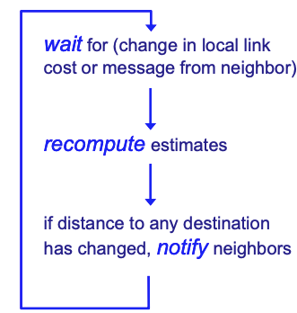
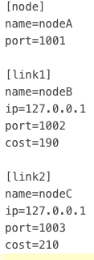
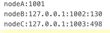
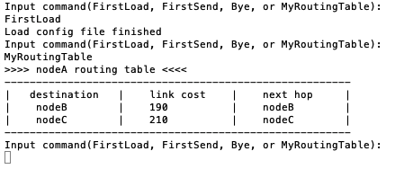
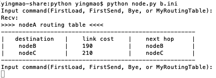

### CISC 4615 Project 1 base code

In the Lab 1, we learned how to programming with sockets and TCP. In the lab 2, we learned
how to work with UPD protocol and integrate CRC into the tranmissions. In this project 1, you
will be constructing a virtual IP-based Network using UDP packets. Your network will support
distance vector routing algorithm, in which you will observe ”good news travels fast” and ”bad
news travels slow” (the example we studied in the lecture).
 

---
#### Disitance Vector Routing Protocol

A distance-vector routing protocol in data networks determines the best route for data packets
based on distance (or link cost). Distance-vector routing protocols measure the distance by
the number of routers a packet has to pass, one router counts as one hop. To determine the
best route across a network routers, on which a distance-vector protocol is implemented, ex-
change information with one another, usually routing tables, which contain the kown link cost.
Distance-vector routing protocols also require that a router informs its neighbours of network
topology changes periodically.

---
#### Bellman-Ford algorithm

In the lectures, we studied the distance-vector routing protocols, which use the BellmanFord
algorithm to calculate the best route.
The BellmanFord algorithm is an algorithm that computes shortest paths from a single source
vertex to all of the other vertices in a weighted digraph. The BellmanFord algorithm based
distance vector routing protocol has the following features,

1. Base assumption: Each router knows its own address and the cost to reach each of its
directly connected neighbors.
2. Bellman-Ford algorithm: Distributed route computation using only neighbor’s information
3. Mitigating loops: Split horizon and posion reverse (omitted in this project)

The following figure shows the operation at each node in the network.

 
 
1. Each node wait for the change of the link cost or a message from your neighbors
2. When there is a change of a link or the node receives a message, recompute the routing
table based on the Bellman-Ford algorithm.
3. If the new routing table is not the same as before, send the updates to all your neighbors
 
 ---
#### Study the sample codes

Please study the sample code to understand the code style and logic of the samples.

You can run the sample code as described below,

- C++ Sample:
	- Compile the code: g++ node.cpp -o node OR g++ -pthread node.cpp -o node
	- Run the code: ./node + config file
	- Note that you should run the code three times with three different configuration files

- Python3 Sample:
	- Run the code: python node.py + config file
	- Note that you should run the code three times with three different configuration files

---

### What does the sample code do?

The sample code support the follow commands,

1. `FirstLoad`: This is the command for loading this node’s configuration file, which consists of the port number to use by this node and the neighbors information. 
 
  
  

2. `MyRoutingTable`: This is the command to print out your routing table. Currently, the code supports building a routing table purely based on the configuration file. <> NO Bellman-Ford Algorithm Implemention. You have to implement it yourself. The figure shows at A when printing out its own routing table.

  

3. `FirstSend`: This is the command to send your routing table to your neighbors. When receiving the routing table, the neighbors will print it out. The figure shows at B when receiving A's routing table.

  

4. `Bye`: Exit the program.

---